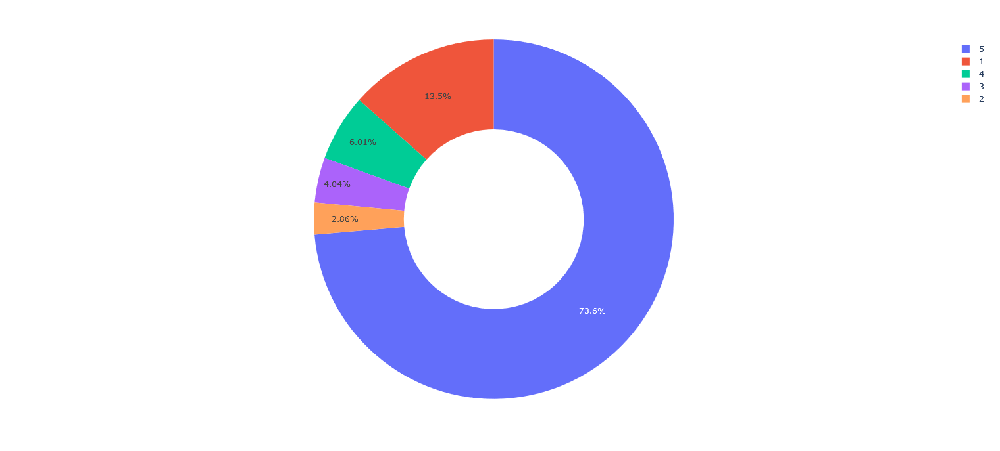
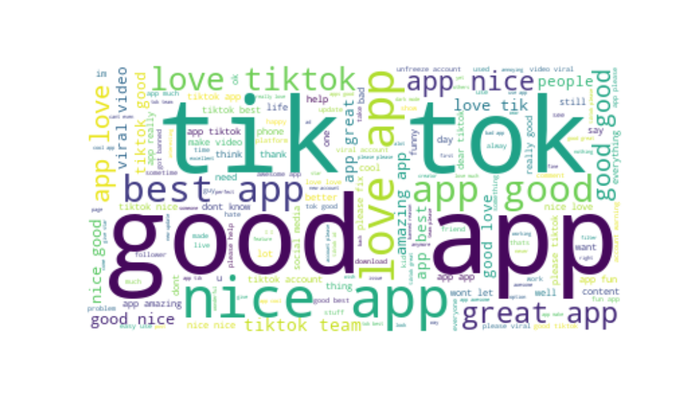
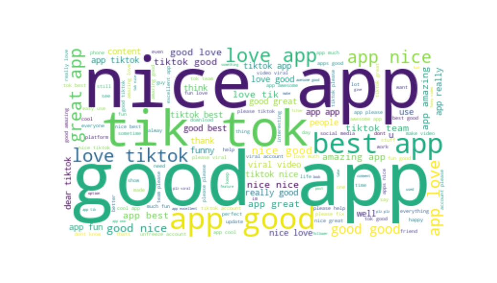
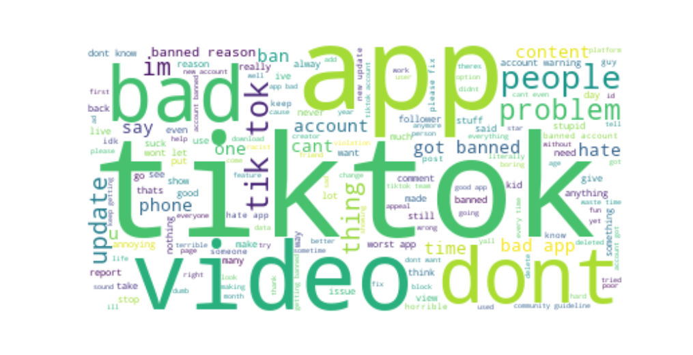

**TikTok Reviews Sentiment Analysis using Python**
==================================================

**We analyze TikTok reviews to find out what people feel about the app's content**
----------------------------------------------------------------------------------
If you have thought about TikTok to run your marketing campaign or like a strategy to expand your positioning in social networks, surely you want to know in advance how the public perceives and values this important platform. This is an example of use to take advantage of with any application mounted in a cloud store.

### EDA Process
We've formated and cleaned Column contet for sentiments analysis.
Next, let's analyze the scores with a pie chart.
  

Here is a general word cloud map by taking the reviews

Next, we create the sentiment analysis using SentimentIntensityAnalyzer, for which we add three new columns in our data frame.
Here, the Positive word cloud.

Here, the Negative word cloud.

### Usage
This short example show how we can develop problem-solving skills and delve deeper into sentiment analysis and PLN techniques.

**Author**
------------

* Renar Zamora - renarzamora@gmail.com

**Tools**
----------------
* Python 3.11, Visual Studio Code, Matplotlib, nltk, nltk.sentiment.vader, WordCloud, Pandas and nltk.corpus.
